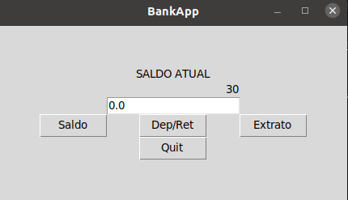
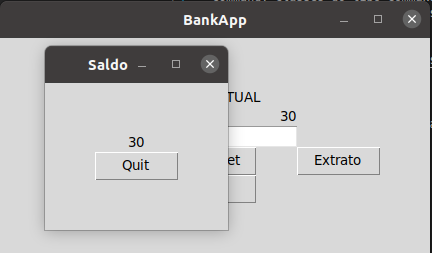
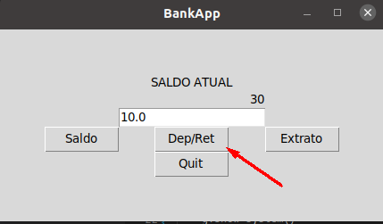
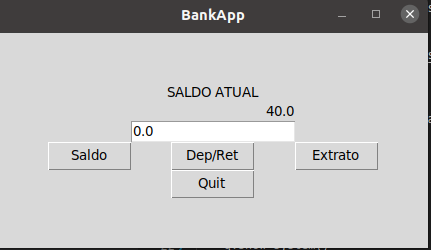
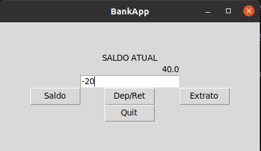
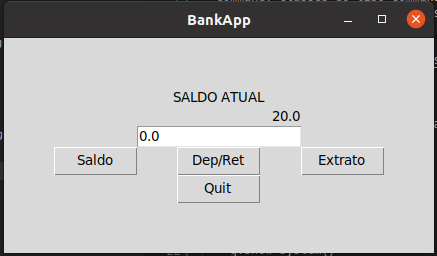
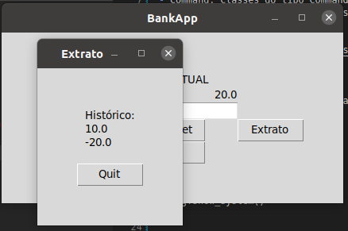

# lab05-ces22

## Banco

Inicialmente vamos fazer uma aplicação bem simples de banco na qual não há transferencia entre contas, mas saque e deposito, consulta de extrato e saldo. Fizemos com design pattern Command.
- Invoker: Classe GUI responsável por renderizar as páginas e fazer a chamada para os botões
- Command: Classes do tipo Command que chamam o receiver
- Receiver: Classe Conta recebe os pedidos e também interage com a classe GUI para receber os parâmetros por exemplo de realizar update.

### Diagrama de classes


### Funcionamento da Aplicação

O Client será a main do arquivo banco.py que define as classes do problema. Nele criamos o objetos que interagem no sistema. Observe a main abaixo:
```
if __name__ == '__main__':

    c = Conta(30)
    g = GUI(c)
    c.setGUI(g)
    g.show_system()
```

- Agora observe a tela inicial:



- Veja a tela de saldo:



- A seguir veja o antes e depois de um deposito de R$ 10,00
Antes:



Depois:



- A seguir veja o antes e depois de um saque de R$ 20,00
Antes:



Depois:



- Por último veja a tela de Extrato ao clicar extrato:



## Documentos

Vamos fazer a implementação utilizando o design pattern State, onde os estados são o draft, moderation e published, no nosso caso como não há uma lógica complexa introduzida com transições draft->moderation->published->draft, em caso de fazer um sistema mais complexo bastaria modificar a parte da lógica de transição(publish nesse caso).

### Diagrama de Classes


#### Exemplo

No nosso caso a main para testes ficou assim

```
if __name__ == '__main__':
    d = Documento("Eu nunca perco. Ou eu ganho, ou aprendo!")
    print(d.render())
    d.publish()
    print(d.render())
    d.publish()
    print(d.render())

    d.publish()
    print(d.render())
```

E a saída como o esperado foi esta:

```
DRAFT: Texto em estado de Draft | Eu nunca p
MODERATION: Texto em estado de moderação | Eu nunca perco. Ou e
PUBLISHED: Texto em estado de Draft | Eu nunca perco. Ou eu ganho, ou aprendo!
DRAFT: Texto em estado de Draft | Eu nunca p
```
